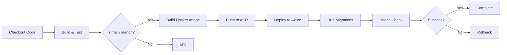

# 🚀 CI/CD Setup Guide

Esta guía documenta todos los secretos y configuraciones necesarias para que los workflows de CI/CD funcionen correctamente.

> **🔐 NOTA IMPORTANTE**: Este proyecto usa **OpenID Connect (OIDC)** para autenticación con Azure, que es más seguro que usar credenciales de Service Principal. Ver [OIDC-SETUP.md](./OIDC-SETUP.md) para la configuración completa de OIDC.

## 📋 Tabla de Contenidos

- [Secretos de GitHub](#secretos-de-github)
- [Configuración de Azure](#configuración-de-azure)
- [Variables de Entorno](#variables-de-entorno)
- [Verificación](#verificación)

---

## 🔐 Secretos de GitHub

Los siguientes secretos deben configurarse en GitHub: **Settings → Secrets and variables → Actions → New repository secret**

### 1. Azure Authentication (OIDC) ⭐ RECOMENDADO

#### `AZURE_CLIENT_ID`

- **Descripción**: Application (client) ID del App Registration en Azure AD
- **Cómo obtenerlo**: Ver [OIDC-SETUP.md](./OIDC-SETUP.md) para la configuración completa

#### `AZURE_TENANT_ID`

- **Descripción**: Directory (tenant) ID de Azure AD
- **Cómo obtenerlo**:
  ```bash
  az account show --query tenantId -o tsv
  ```

#### `AZURE_SUBSCRIPTION_ID`

- **Descripción**: ID de tu Azure Subscription
- **Cómo obtenerlo**:
  ```bash
  az account show --query id -o tsv
  ```

---

### 2. Azure Container Registry (ACR)

#### `ACR_USERNAME`

- **Descripción**: Nombre de usuario del Azure Container Registry
- **Valor**: `examgeneratorcj`
- **Cómo obtenerlo**:
  ```bash
  az acr credential show --name examgeneratorcj --query username -o tsv
  ```

#### `ACR_PASSWORD`

- **Descripción**: Contraseña del Azure Container Registry
- **Valor**: [Sensible - obtener de Azure]
- **Cómo obtenerlo**:
  ```bash
  az acr credential show --name examgeneratorcj --query "passwords[0].value" -o tsv
  ```

---

### 3. Frontend Configuration

#### `NEXT_PUBLIC_API_URL` (opcional)

- **Descripción**: URL del backend API para el frontend
- **Valor por defecto**: `https://exam-generator-backend.kindforest-d0a6102e.swedencentral.azurecontainerapps.io`
- **Nota**: Si no se configura, usa el valor por defecto hardcodeado
- **Cuándo configurarlo**: Si cambias la URL del backend o tienes múltiples ambientes

---

## ☁️ Configuración de Azure

### Recursos Necesarios

Los siguientes recursos deben existir en Azure:

1. **Resource Group**: `exam-generator-rg`
2. **Container Registry**: `examgeneratorcj.azurecr.io`
3. **Container Apps**:
   - `exam-generator-backend`
   - `exam-generator-frontend`

### Verificar Recursos

```bash
# Verificar Resource Group
az group show --name exam-generator-rg

# Verificar Container Registry
az acr show --name examgeneratorcj

# Verificar Container Apps
az containerapp show --name exam-generator-backend --resource-group exam-generator-rg
az containerapp show --name exam-generator-frontend --resource-group exam-generator-rg
```

---

## 🔧 Variables de Entorno

### Variables en los Workflows

Estas están definidas en los archivos `.github/workflows/*.yml`:

| Variable                   | Valor                                                | Descripción                      |
| -------------------------- | ---------------------------------------------------- | -------------------------------- |
| `REGISTRY`                 | `examgeneratorcj.azurecr.io`                         | URL del Azure Container Registry |
| `IMAGE_NAME`               | `exam-generator-backend` o `exam-generator-frontend` | Nombre de la imagen Docker       |
| `AZURE_CONTAINER_APP_NAME` | `exam-generator-backend` o `exam-generator-frontend` | Nombre del Container App         |
| `AZURE_RESOURCE_GROUP`     | `exam-generator-rg`                                  | Nombre del Resource Group        |

### Variables de Entorno de la Aplicación

Estas deben configurarse en Azure Container Apps directamente:

#### Backend

- `DATABASE_URL`
- `REDIS_HOST`, `REDIS_PORT`, `REDIS_PASSWORD`
- `JWT_SECRET`
- `AZURE_STORAGE_ACCOUNT_NAME`, `AZURE_STORAGE_ACCOUNT_KEY`
- `AZURE_OPENAI_API_KEY`, `AZURE_OPENAI_ENDPOINT`
- Etc. (ver `docker-compose.prod.yml` para lista completa)

#### Frontend

- `NEXT_PUBLIC_API_URL` (configurado en build time)

---

## ✅ Verificación

### 1. Verificar Secretos de GitHub

1. Ve a tu repositorio en GitHub
2. **Settings → Secrets and variables → Actions**
3. Verifica que existan los siguientes secretos:
   - ✅ `AZURE_CLIENT_ID`
   - ✅ `AZURE_TENANT_ID`
   - ✅ `AZURE_SUBSCRIPTION_ID`
   - ✅ `ACR_USERNAME`
   - ✅ `ACR_PASSWORD`
   - ⚠️ `NEXT_PUBLIC_API_URL` (opcional)

### 2. Probar Autenticación de Azure con OIDC

```bash
# Verificar que la App Registration existe
az ad app list --display-name "exam-generator-github-oidc"

# Verificar Federated Credentials
az ad app federated-credential list --id <AZURE_CLIENT_ID>

# Verificar permisos
az role assignment list --assignee <AZURE_CLIENT_ID> --output table
```

### 3. Probar Push al Container Registry

```bash
# Login al ACR
az acr login --name examgeneratorcj

# O con credenciales directas
docker login examgeneratorcj.azurecr.io \
  --username <ACR_USERNAME> \
  --password <ACR_PASSWORD>

# Push de prueba (opcional)
docker tag test-image examgeneratorcj.azurecr.io/test-image:latest
docker push examgeneratorcj.azurecr.io/test-image:latest
```

### 4. Verificar Workflows

1. Ve a **Actions** en GitHub
2. Ejecuta manualmente un workflow: **Run workflow**
3. Revisa los logs para detectar errores

---

## 🔄 Flujo de CI/CD

### Triggers

Los workflows se ejecutan en los siguientes casos:

1. **Push a `main` o `develop`**:
   - ✅ Build & Test
   - ✅ Build & Push Image
   - ✅ Deploy (solo en `main`)

2. **Pull Request a `main` o `develop`**:
   - ✅ Build & Test
   - ❌ No Build & Push
   - ❌ No Deploy

3. **Manual (workflow_dispatch)**:
   - ✅ Ejecución manual desde GitHub Actions

### Pipeline Steps



---

## 🆘 Troubleshooting

### Error: "Login failed"

- Verifica que `AZURE_CREDENTIALS` esté correctamente configurado
- Asegúrate de que el Service Principal tenga permisos de `contributor`

### Error: "Image not found"

- Verifica que el ACR tenga las credenciales correctas
- Revisa que el nombre del registry sea correcto: `examgeneratorcj.azurecr.io`

### Error: "Container App not found"

- Verifica que los Container Apps existan en Azure
- Revisa que los nombres coincidan exactamente

### Error: "Health check failed"

- Revisa los logs del Container App en Azure Portal
- Verifica que las variables de entorno estén correctamente configuradas
- Asegúrate de que los endpoints `/health` y `/api/health` funcionen

---

## 📚 Referencias

- [Azure Container Apps Documentation](https://learn.microsoft.com/en-us/azure/container-apps/)
- [GitHub Actions for Azure](https://github.com/Azure/actions)
- [Docker Build Push Action](https://github.com/docker/build-push-action)
- [Azure Container Apps Deploy Action](https://github.com/Azure/container-apps-deploy-action)

---

## 🔄 Actualizaciones

| Fecha      | Cambio                       |
| ---------- | ---------------------------- |
| 2024-02-02 | Documentación inicial creada |
