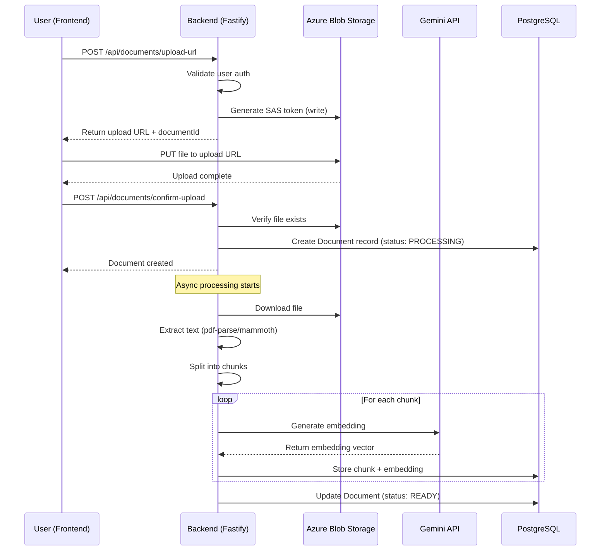
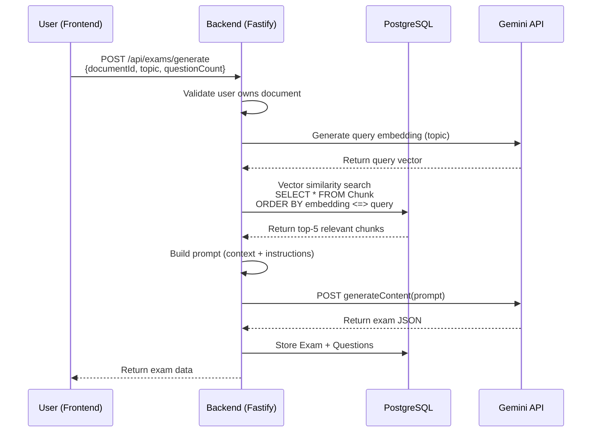
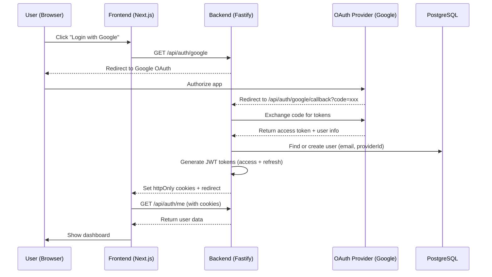

# System Architecture - Exam Generator

**Last Updated**: 2026-01-26

---

## High-Level Architecture Diagram

```mermaid
graph TB
    subgraph "Frontend - Next.js 15"
        UI[React Components<br/>shadcn/ui + Tailwind]
        Auth[Auth Context]
        API_Client[API Client<br/>React Query]
    end

    subgraph "Backend - Fastify API"
        Routes[API Routes]
        AuthMiddleware[Auth Middleware<br/>Passport.js + JWT]
        
        subgraph "Services"
            AuthService[Auth Service]
            DocumentService[Document Service]
            ExamService[Exam Service]
            StorageService[Storage Service]
        end
        
        subgraph "Repositories"
            UserRepo[User Repository]
            DocumentRepo[Document Repository]
            ExamRepo[Exam Repository]
        end
    end

    subgraph "External Services"
        Azure[Azure Blob Storage<br/>Document Files]
        Gemini[Google Gemini API<br/>Embeddings + Generation]
    end

    subgraph "Database - PostgreSQL + pgvector"
        Users[(Users Table)]
        Documents[(Documents Table)]
        Chunks[(Chunks Table<br/>+ Embeddings)]
        Exams[(Exams Table)]
        Questions[(Questions Table)]
    end

    UI --> Auth
    UI --> API_Client
    API_Client -->|HTTP/REST| Routes
    Routes --> AuthMiddleware
    AuthMiddleware --> AuthService
    AuthMiddleware --> DocumentService
    AuthMiddleware --> ExamService
    
    AuthService --> UserRepo
    DocumentService --> DocumentRepo
    DocumentService --> StorageService
    ExamService --> ExamRepo
    
    UserRepo --> Users
    DocumentRepo --> Documents
    DocumentRepo --> Chunks
    ExamRepo --> Exams
    ExamRepo --> Questions
    
    StorageService -->|@azure/storage-blob| Azure
    DocumentService -->|Embeddings API| Gemini
    ExamService -->|Generation API| Gemini
    
    Chunks -.->|Vector Search<br/>pgvector| ExamService
```

---

## Component Responsibilities

### Frontend (Next.js 15)

| Component | Responsibility |
|-----------|----------------|
| **UI Layer** | User interface (forms, tables, modals) using shadcn/ui components |
| **Auth Context** | Manage user session, JWT tokens, logout |
| **API Client** | HTTP calls to backend, token refresh, error handling |
| **Pages** | `/login`, `/dashboard`, `/documents`, `/exams` |

**Tech Stack**:
- Next.js 15 (App Router)
- TypeScript
- Tailwind CSS
- shadcn/ui (Radix UI primitives)
- React Query (server state)
- Zustand (client state)

---

### Backend (Fastify)

#### API Routes
- **Authentication**: `/api/auth/*` (login, register, OAuth callbacks)
- **Documents**: `/api/documents/*` (upload, list, delete)
- **Exams**: `/api/exams/*` (generate, list, get details)

#### Services (Business Logic)
- **AuthService**: User registration, login, token generation
- **DocumentService**: File upload, text extraction, chunking, embedding generation
- **ExamService**: RAG-based exam generation, retrieval, scoring
- **StorageService**: Azure Blob operations (upload, download, delete)

#### Repositories (Data Access)
- **UserRepository**: CRUD for users
- **DocumentRepository**: CRUD for documents + chunks
- **ExamRepository**: CRUD for exams + questions

**Tech Stack**:
- Fastify
- TypeScript
- Prisma (ORM)
- Passport.js (auth strategies)
- JWT (sessions)
- Vitest (testing)

---

### Database (PostgreSQL + pgvector)

#### Schema Overview

```prisma
model User {
  id            String     @id @default(uuid())
  email         String     @unique
  passwordHash  String?    // Null for OAuth users
  name          String
  role          Role       @default(TEACHER)
  provider      Provider?  // LOCAL, GOOGLE, GITHUB, MICROSOFT
  providerId    String?    // OAuth provider user ID
  documents     Document[]
  exams         Exam[]
  createdAt     DateTime   @default(now())
  updatedAt     DateTime   @updatedAt
}

model Document {
  id          String   @id @default(uuid())
  title       String
  filename    String
  blobUrl     String   // Azure Blob Storage URL
  mimeType    String
  sizeBytes   Int
  status      DocStatus @default(PROCESSING) // PROCESSING, READY, FAILED
  userId      String
  user        User     @relation(fields: [userId], references: [id])
  chunks      Chunk[]
  exams       Exam[]
  createdAt   DateTime @default(now())
  updatedAt   DateTime @updatedAt
  
  @@index([userId, createdAt])
}

model Chunk {
  id         String                 @id @default(uuid())
  content    String                 @db.Text
  embedding  Unsupported("vector(768)")? // pgvector
  position   Int                    // Chunk order in document
  documentId String
  document   Document               @relation(fields: [documentId], references: [id], onDelete: Cascade)
  createdAt  DateTime               @default(now())
  
  @@index([documentId, position])
}

model Exam {
  id          String     @id @default(uuid())
  title       String
  topic       String
  documentId  String
  document    Document   @relation(fields: [documentId], references: [id])
  userId      String
  user        User       @relation(fields: [userId], references: [id])
  questions   Question[]
  createdAt   DateTime   @default(now())
  updatedAt   DateTime   @updatedAt
  
  @@index([userId, createdAt])
}

model Question {
  id          String   @id @default(uuid())
  examId      String
  exam        Exam     @relation(fields: [examId], references: [id], onDelete: Cascade)
  question    String   @db.Text
  optionA     String
  optionB     String
  optionC     String
  optionD     String
  correctAnswer String  // "A", "B", "C", or "D"
  explanation String   @db.Text
  difficulty  String   // "easy", "medium", "hard"
  position    Int      // Question order in exam
  
  @@index([examId, position])
}

enum Role {
  TEACHER
  STUDENT
}

enum Provider {
  LOCAL
  GOOGLE
  GITHUB
  MICROSOFT
}

enum DocStatus {
  PROCESSING
  READY
  FAILED
}
```

---

### External Services

#### Azure Blob Storage
- **Purpose**: Store uploaded PDFs and DOCX files
- **Container**: `exam-generator-documents`
- **Structure**: `{userId}/{documentId}.{ext}`
- **Access**: SAS tokens (time-limited, signed URLs)

#### Google Gemini API
- **Embeddings**: `text-embedding-004` (768 dimensions)
- **Generation**: `gemini-1.5-pro` (exam questions)
- **Rate Limits**: 15 req/min (embeddings), 2 req/min (generation) on free tier

---

## Data Flow Diagrams

### Document Upload & Processing



---

### Exam Generation (RAG)



---

### Authentication Flow (OAuth)



---

## Security Architecture

### Authentication & Authorization

```
┌─────────────────────────────────────────────────────┐
│  Request with JWT (httpOnly cookie)                 │
└─────────────────┬───────────────────────────────────┘
                  │
                  ▼
┌─────────────────────────────────────────────────────┐
│  Auth Middleware (Passport.js + JWT)                │
│  - Validate JWT signature                           │
│  - Check expiration                                 │
│  - Extract user ID + role                           │
└─────────────────┬───────────────────────────────────┘
                  │
                  ▼
┌─────────────────────────────────────────────────────┐
│  Authorization Check (Route Level)                  │
│  - Verify user owns resource (documentId, examId)   │
│  - Check role permissions (teacher vs student)      │
└─────────────────┬───────────────────────────────────┘
                  │
                  ▼
┌─────────────────────────────────────────────────────┐
│  Business Logic (Services)                          │
└─────────────────────────────────────────────────────┘
```

### Data Security

- **Passwords**: bcrypt hashed (12 rounds)
- **JWT**: RS256 signed (asymmetric keys)
- **Files**: Private Azure container (SAS tokens)
- **Database**: SSL connections, parameterized queries (Prisma)
- **API Keys**: Environment variables (never committed)

---

## Deployment Architecture (Azure)

```
┌─────────────────────────────────────────────────────┐
│  Azure Load Balancer / Application Gateway          │
└─────────────────┬───────────────────────────────────┘
                  │
        ┌─────────┴─────────┐
        │                   │
        ▼                   ▼
┌───────────────┐   ┌───────────────┐
│ Frontend      │   │ Backend       │
│ (Static Web   │   │ (App Service) │
│  Apps)        │   │               │
└───────────────┘   └───────┬───────┘
                            │
        ┌───────────────────┼───────────────────┐
        │                   │                   │
        ▼                   ▼                   ▼
┌───────────────┐   ┌───────────────┐   ┌───────────────┐
│ PostgreSQL    │   │ Blob Storage  │   │ Gemini API    │
│ (Azure DB)    │   │               │   │ (External)    │
└───────────────┘   └───────────────┘   └───────────────┘
```

**Services**:
- **Frontend**: Azure Static Web Apps (CDN + HTTPS)
- **Backend**: Azure App Service (Node.js 20)
- **Database**: Azure Database for PostgreSQL (with pgvector)
- **Storage**: Azure Blob Storage (Hot tier)
- **Monitoring**: Azure Application Insights

---

## Technology Decisions Summary

| Layer | Technology | Justification |
|-------|------------|---------------|
| **Monorepo** | pnpm + Turborepo | Fast builds, intelligent caching |
| **Frontend** | Next.js 15 + TypeScript | App Router, Server Components, type safety |
| **Backend** | Fastify + TypeScript | Performance, plugin ecosystem |
| **Database** | PostgreSQL + pgvector | Relational + vector search in one |
| **Auth** | Passport.js + JWT | Flexibility, OAuth support |
| **AI** | Google Gemini | Free tier, long context, multimodal |
| **Storage** | Azure Blob | Integration with Azure ecosystem |
| **RAG** | Custom implementation | Learning value, no framework overhead |

---

## Performance Targets

### Backend API
- **Response Time**: <200ms (p95) for API endpoints
- **Document Processing**: <30s for 10MB PDF
- **Exam Generation**: <10s for 10 questions

### Frontend
- **First Contentful Paint**: <1.5s
- **Time to Interactive**: <3s
- **Core Web Vitals**: All green

### Database
- **Vector Search**: <100ms for 5k chunks
- **Query Performance**: <50ms for CRUD operations

---

## Scalability Considerations

### Current Scale (MVP)
- **Users**: 100 concurrent
- **Documents**: 1000 total
- **Requests**: 1000 req/hour

### Future Scale (Production)
- **Users**: 10,000 concurrent
- **Documents**: 100,000 total
- **Requests**: 100,000 req/hour

**Scaling Strategy**:
1. **Horizontal scaling**: Add more App Service instances
2. **Database**: Read replicas for vector search
3. **Caching**: Redis for API responses
4. **Queue**: BullMQ for async document processing
5. **CDN**: Azure Front Door for global delivery

---

## Monitoring & Observability

### Logging
- **Backend**: Pino logger (JSON structured logs)
- **Frontend**: Browser console + error tracking

### Metrics
- **Application Insights**: Request traces, exceptions
- **Custom Metrics**: Document processing time, exam generation latency

### Alerts
- **Error Rate**: >5% errors in 5min
- **Latency**: p95 >500ms
- **Database**: Connection pool exhaustion

---

## Related Documentation
- See `docs/adr/` for architectural decisions
- See `docs/specs/` for functional specifications

**Last Updated**: 2026-01-26
